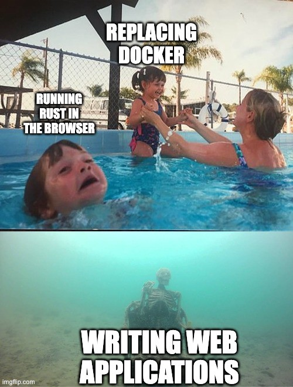

# The Promise

Web Assembly is, in my view, one of the most important developments to the web platform since paradigm shifting inclusions like ajax requests.

When Web Assembly was introduced almost a decade ago, it was described as a solution to many various web-centric problems and I have been watching its progress eagerly, waiting for the day I can use it.

## No More Transpilers!
One challenge it sought to address was the pattern of code-to-code compilation (transpilation) utilized prolifically by web application developers.

Web applications, even those written in JavaScript, use bundlers and code optimisers to optimise their applications for evaluation and network transfer. These compiler tools take the source language and output efficient JavaScript.

  Source Code
  ↓
  Webpack + Babel + Terser
  ↓
  Smaller Unreadable JavaScript

Web Assembly offered the promise of using a more efficient bytecode as a compile target for these use cases, allowing for smaller “bundles” that parsed quicker.

  Source Code
  ↓
  WASM JavaScript Compiler
  ↓
  Tiny WASM Binary

## Multiple Languages

It’s currently possible to convert many languages to the Web by using code-to-code transpilation methods.

There is a Go to JavaScript compiler and famously TypeScript, CoffeeScript, ClojureScript all convert their source code into JavaScript. This approach works however it leaves much to be desired.

There may be language-specific features that cannot be emulated in the resulting JavaScript output (such as parallelism in Go) and you risk poor third party library support.

Web Assembly’s binary format offers a compile target that is unconstrained by the language feature limitation of using JavaScript when used as a compile target.

This makes it worth investing the time for language maintainers to offer official support for Web Assembly as a compile target.

## JavaScript killer?

The mantra goes that Web Assembly will not kill JavaScript and this is true for the most part.

When we look at the history of web technologies, the shift towards web applications which house a majority of logic into the client did not “kill” php or other server driven UI technologies.

In reality, there are decades of simple websites powered by WordPress and similar that run on JavaScript and they aren’t going anywhere.

While a simple website that needs some scripting to open a menu doesn’t need a complicated toolchain, more advanced applications stand to benefit from being able to pick languages better suited to their use case and the skill set of their developers.

When we look at the growing desire to write Single Page Applications that resembled native mobile and native desktop applications, we observe they bring with them some of the same conceptual challenges that native applications have but in a platform that does not offer the same supporting UI toolkits to handle complex behaviours (like navigation, multi-threading, etc).

I can’t overstate enough the importance of multi threading in client applications — something that JavaScript lack quality support for and it’s one of the reasons why native applications are smoother and more performant.

## Natural Evolution

With the web platform being so approachable, profitable but slow to innovate, user land libraries and frameworks like React and Angular were inevitable. They attempt to push beyond the limits of the platform before it was ready, offering developers new features and allowing more maintainable codebases.

Polyfills and progressive enhancement dominates as projects that were starving for new features tried to get there sooner.

While not (directly) related to Web Assembly, Electron/PhoneGap applications started appearing as the relatively low cost of developing web applications combined with their platform portability made it the obvious choice when faced with distributing applications on Windows, MacOS, Linux (jokes, who develops for Linux 😭), iOS and Android.

We are now seeing web frameworks in Rust and Go that target Web Assembly are emerging, despite having to implement an insane amount of glue code to function.

What we can observe is a pattern in the web where slow advancement and high demand to do things well (and cost efficiently) has resulted in many projects creating hacky implementations by whatever means are available.

## JavaScript, the Every Language

What has been interesting to observe is this pressure by so many projects to advance the web combined with the fact that teams cannot bring their own stack has resulted in the ES standard becoming a language that represents bits and pieces from every major language.

Web Assembly represents a fundamental shift in that thinking.

If a company that loves functional programming could use full fat Closure or F#, they wouldn’t care if ES implements the pipe operator.

If a company that loves object oriented programming could use Java, C#, Kotlin, they wouldn’t care if ES implements decorators.

This doesn’t mean that JavaScript will disappear into irrelevance as there will always be a need for a simple scripting language native to the platform that doesn’t require complex compilation.

## What about runtimes?

Runtimes must be provided with your wasm baniary in order to run the application code.

There are many strategies to manage this. One approach is “code splitting” the runtimes, otherwise described as cacheable runtimes that can be dynamically linked.

Another approach is writing your application in languages that require minimal/no runtime code like Rust or TinyGo.

## Focus from JavaScript to the DOM and platform features

Assuming Web Assembly has the same powers as JavaScript, it offers external language developers the ability to grow and maintain their language independently of the browser — reducing the pressure on the designers of the ES standard and browser developers.

I would argue that advancing web platform features represent more value than advancing ES features. For instance;

Offering user opt-in sandboxed/safe lower level access to OS functionality would render projects like Electron redundant and offer users more efficient web-powered desktop applications — projects like VSCode and Slack could truly become installable web applications that could be better optimised due to sharing the same browser engine rather than a new independent Electron process.

A focus on developing better specifications for improving privacy through things like user opt-in permanent storage and efficiently sandboxable third-party scripts are more important contributions than the pipe operator.

And as such, having browser vendors implementing new ES features when they could be focusing on things like better privacy or browser capabilities appears to be a waste of resources

## So, where are we today?

It’s easy (and unpopular) to be critical of the progress we’ve seen in the development of Web Assembly but I think it’s healthy to ask where we are at, try to get an understanding of what the future holds and find where we can help.

## Academic, mostly

The development of Web Assembly has mostly been an academic endeavour and with that lens applied to it, it has made remarkable progress.

However, when we look at the commercial (and passion project) applications of Web Assembly today, they are limited and burdened with integration complexity.

It’s amazing to see libraries like ffmpeg and image compression libraries ported to the web through Web Assembly, however in my day-to-day web development endeavors, I seldom come across a use case where I need to compress/convert video/images in the browser in ways that justify the added complexity of integrating a wasm module (I have previously compressed images prior to upload using canvas).

In its current form, Web Assembly is essentially just a hard to integrate Web Worker that can be written in languages other than JavaScript. Outside of select use cases, wasm represents a net loss in application performance.

## Web Assembly has an attention and PR problem

The people contributing to the Web Assembly project are incredibly intelligent individuals and as such, identified that the project has the potential to be abstracted such that it could be used to solve problems outside of the web domain.

However, without the general ability for the average web developer to use Web Assembly for practically anything — it’s not really a project that gets the attention it deserves.

It’s my opinion that Web Assembly has gone down the path of premature abstraction prior to delivering a product that generates interest in developing it further.

To put into perspective how long ago Web Assembly was announced, here are some things that happened around the time it was announced and after:

- React was in alpha and has since progressed to v18

- Vue was in alpha and has since progressed to v3

- Angular 2 was announced and has since progressed to v14

- The first stable release of Rust (v1) was released

- The Linux kernel version was still 3.x.x , currently 5.x.x

- Chrome was at version 30, currently 103
 
- Windows 10 was announced and Windows 11 was released

- We were at the iPhone 6

- The Touch Bar MacBooks didn’t exist yet

- Obama was the president of the USA

Given the value wasm represents, I think it’s important the project gets back on track to let us create kick ass, high-performance client applications.

## What can you do?

Contributing to the WASM specification requires a very specific skill set and for a lot of engineers, this can discourage participation in contributing to the spec itself.

Engineers can, however, contribute to Web Assembly without directly contributing to the specification by identifying why they want it and advocating investment in it.

## What do you want to use it for?

The question I think is important to ask is, what do you need web assembly for?

Does Web Assembly mean that projects like Angular, Svelte and Vue that use compilers to convert their template syntax into AoT optimised DOM manipulation instructions could reinvent themselves away from the limitations of their hacky/limiting approaches to detecting mutation (monkey patching, zone.js, Proxy traps).

Does Web Assembly mean that you can take your existing strict TypeScript React application and, without changes, ship a smaller binary that’s faster and more efficient?

Does Web Assembly mean you can build your next SPA in C++, Rust, or Go and multi-thread the heck out of it?

## What does that mean for your product/company?

When you think of what you need from Web Assembly, does that apply to materially improve your product?

- Will it improve application performance giving a better experience to customers?

- Will the more efficient operation allow you to distribute your application to a broader range devices, reaching more consumers?

- Does the prospect of using the same language on the client as the server offer the opportunity to share code/models such that it improves platform stability?

- Does the language homogeneity allow you to focus your hiring requirements on a single language and better utilize your existing engineering resources?

- Can you quantify the improvement Web Assembly represents?

Better yet, can you financially quantify how Web Assembly will help?

Appeal to your respective companies and sponsors to invest interest and time developing or advocating for their use case to be represented in Web Assembly!

The project lives or dies on participation, and if no one is excited by the promises it offers, participation will wane
