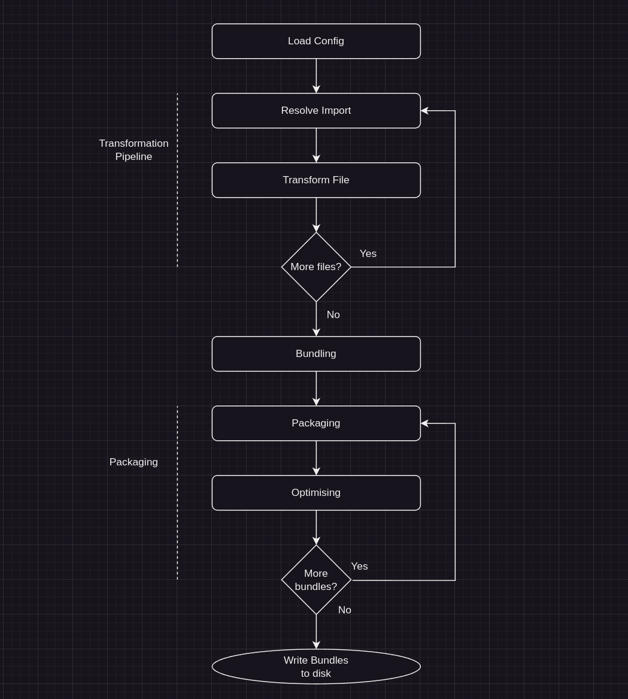
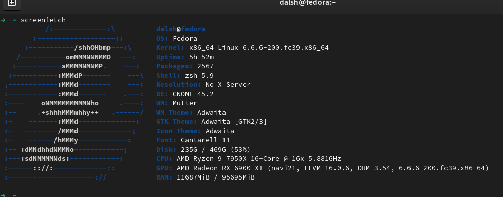
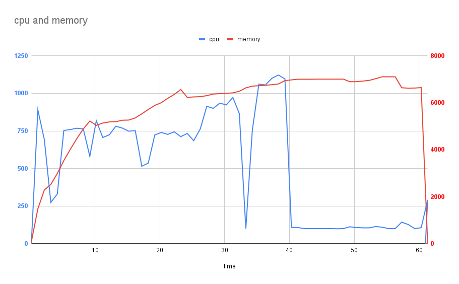

### Introduction

In the world of today's web development landscape, JavaScript applications require a bundler to combine, convert and optimize the source code of a project.

Many bundlers have appeared in this time, each learning from their predecessors and brining with them distinct features and advancements - such as; 

- Dead code elimination (commonly known as tree shaking)
- Federated modules
- Hot module reloading
- Faster build times
- Faster run times
- etc

A popular trend amongst JavaScript build tools today is a migration to a language better suited to the high performance workloads demanded of bundlers and an improved ability to leverage multi-threading to improve build times.

A common choice is Rust - [rspack](https://www.rspack.dev/), [turbopack](https://turbo.build/pack). Another common choice is Go - [esbuild](https://esbuild.github.io/).

Both languages offer fantastic features to enable building high performance and aggressively multi-threaded bundlers.

An interesting case study for an attempt to write a multi-threaded bundler in JavaScript is the [Parcel bundler](https://parceljs.org/). 

Parcel brought to the table many novel features to the JavaScript bundling world; like incremental bundling, a cache system, a plugin system that is both ergonomic and sensible, and an opinionated zero-configuration (or minimal) build environment.

In addition - Parcel leverages Node.js worker threads, scheduling jobs across threads, to improve bundling performance.

This article series will explore the performance characteristics of Parcel, comparing them to a bundler we will write in Rust over the course of this series. I aim to get a better understanding bundling and becoming familiar with the limitations of Node.js in the context of a highly threaded workload.

_I'd like to note that this is not intended to criticize Parcel. Parcel is a phenomenal project with many dedicated brilliant contributors that has inspired me to learn more about writing a bundler and sharing those learnings._

## Objective

We are going to write our own bundler in Rust, one that targets building applications which exist at "hyper" scale.

I define hyper scale as an application that has tens of thousands of files - presumably operating with millions of users.

I picked this target because this is a context where conventional bundler tooling tends to struggle and the biggest gains from threading are to be had.

I would like to preserve the plugin model offered by Parcel as best as possible as I find it to be extremely ergonomic.

This first article will center around the creation of the first phase in the bundling process - transformation.

## Bundler Phases

Parcel's bundling pipeline follows roughly the following flow:


<br>

You can also view a more fully featured flow diagram on [Parcel's website](https://parceljs.org/plugin-system/overview/)

We will begin by implementing the transformer pipeline.

### Transformation

The transformation phase is broken down into 2 major steps

- Resolving imports
- Transforming Files

### Resolution

The first step in the transformation loop is dependency resolution. To understand resolution we must first understand JavaScript imports.

JavaScript imports adhere to the following syntax:

```javascript
import { something } from "specifier";
```

The string used as an target of an import target is known as the "specifier".

This specifier could be a relative path, absolute path, or an alias with rules described by the runtime or the bundler.

```javascript
import { fromRelative } from "./relative"
import { fromAbsolute } from "/probably/dont/do/this"

// Rules specific to Node.js that obtains an import from 
// the node_modules folder. This is known as "node module resolution"
import { fromNodeModules } from "lodash/get"

// Special custom rules the developer can specify in the bundler
// to allow path aliases
import { fromAlias } from "~root/some-path"
```

While it would be great if a specifier could only ever be a relative or absolute unix path, Node.js has special rules to enable loading files from paths - like node_modules.

Additionally, there are conditional resolution rules that are determined by the environment, this allows for the same import path to resolve to different files based on the environment that the JavaScript is evaluated in (like commonjs or modules).

Node.js also has the ability to incorporate middleware (loaders) which intercepts imports at runtime and rewrites the target file path dynamically.

To resolve an import, the bundler needs two pieces of information:
- A `from` path - describing the absolute path of the file doing the importing 
- A `specifier` - describing the thing being imported

The resulting output of an import resolution is an absolute path to the file the import is targeting. 

#### Example

```javascript
// /absolute/path/to/index.js
import "./a.js"
```

This will inform the resolver that `/absolute/path/to/index.js` is importing the specifier `./a.js` which will end up resolving to `/absolute/path/to/a.js`.

### Transforming the file contents and new extracting specifiers

Once the transformation pipeline has an absolute file path to a target file, the bundler will then read the file and will potentially transpile the contents from one type to another - for example convert TypeScript into JavaScript or SASS into CSS.

New specifiers are discovered during transpilation and are added to the queue of files to be resolved then transformed.

Files will be resolved/transformed recursively until all the files are discovered and there are no more files that contain imports.

<video controls>
  <source src="assets/video-1.mp4" type="video/mp4">
</video>


#### Example

In our previous example, the bundler will be instructed to transform  `/absolute/path/to/a.js`. 

Once loaded and parsed, the import specifiers will be extracted from `a.js` and be resolved. 

If `a.js` imports any other files - say `b.js` - then `b.js` will be marked to be resolved and transformed.


### Limitations

The problem with this approach is that work is discovered lazily as files are processed. Parallelizing this approach may result in idle threads or a slower ramp up of threads engaging with transformation tasks.

Unfortunately, due to the requirement of conditional import aliases/specifiers/rules, it’s likely impossible that a JavaScript bundler will know all the files it must transform without walking each file individually and resolving their import specifiers.

There are techniques (like caching) that are helpful here however a large number of third party packages rely on these funny resolution rules making it impossible to avoid source discovery though crawling files - even if your codebase is perfect.

There are optimizations that could be made - like inferring the location of source file from metadata like `tsconfig.json#includes` or assuming that a directory called `src` will contain all source files - however we will not dig into these optimizations in this article.

## The Experiment - What if the bundler knew everything ahead of time?

In a perfect world, the bundler would know all the files it needs to transform before transformation begins and then simply divide that up between threads let loose on processing them.

Devising an experiment that presents this scenario allows us to examine the theoretical limit to how fast the transformation pipeline can be implemented.

In reality, an actual bundler will not be able to achieve this level of performance - however it does serve to indicate how close we can get to the theoretical maximum.

## The Benchmark

The first thing we need is something to bundle. For this I have taken the familiar three-js benchmark from esbuild. 

Three JS is a suitable benchmark because it has a large dependency graph, non trivial transformations, is written using valid module syntax and has no external dependencies.

To scale the benchmark up; we take the three-js source code, copy it 250 of times which will contain approximately 90,000 assets, then generate an entry point that imports each copy to be bundled.


The entry point looks like this:

```javascript
import * as copy_1 from './copy_1/Three.js';
import * as copy_2 from './copy_2/Three.js';
import * as copy_3 from './copy_3/Three.js';
// ... to n

// To avoid tree shaking:
window.copy_1 = copy_1;
window.copy_2 = copy_2;
window.copy_3 = copy_3;
// ... to n
```

## Test Hardware

I will be using my personal desktop computer that has the following hardware:



|||
|-|-|
|CPU|AMD Ryzen 7950x - 16 Cores @ 5.8ghz (SMT off) |
|RAM|98 GB|
|SSD|PCI-E NVMe SSD (silly fast I/O)|
|OS|Fedora Linux 39|

## Baseline

To obtain a baseline for performance, I compiled the benchmark project using Parcel - where I force the build to exit once the transformation pipeline completes.

I will be using [procmon]() to capture the system resource usage of the build.

The number of worker threads Parcel spawns is controlled with the `PARCEL_WORKERS` environment variable. 

For the build to pass I had to increase Node.js's worker memory ceiling with  `max-old-space-size` command line argument.

```bash
env \
    PARCEL_WORKERS=16 \
    PM_MEM_UNITS=mb \
    PM_TIME_UNITS=s \
    PM_TRACK=cpu,memory \
    PM_REPORT=parcel_x16.csv \
        procmon \
            node --max-old-space-size=5000 ./node_modules/parcel/lib/bin.js build ./entry/entry.js \
                --no-cache --dist-dir ./dist --cache-dir .cache
```

### Results

*Note: Keep in mind this is not a full build, this is just the transformation phase of the build*

Running the build we see the following results:



The transformation took 60 seconds where the CPU usage peaked at about 11 cores and averaged 5 cores. The process consumed 7gb of RAM.

Let's inspect the relationship between the number of threads against the build time.

To do this I am using the following bash:

```bash
for THREADS in $(seq 0 15); do
    env \
        PARCEL_WORKERS=$THREADS \
        PM_MEM_UNITS=mb \
        PM_TIME_UNITS=s \
        PM_TRACK=cpu,memory \
        PM_REPORT=parcel_$THREADS.csv \
            procmon \
                node --max-old-space-size=5000 ./node_modules/parcel/lib/bin.js build ./entry/entry.js \
                    --no-cache --dist-dir ./dist --cache-dir .cache
done
```

When the `PARCEL_WORKER` variable is set to `0`, Parcel will run the compilation on the main thread. So that means `main thread + 16 worker = total threads`.


What we can observe is that we stop seeing improvements beyond 4 threads however there is a continued escalation of maximum CPU usage, while average CPU usage remains the same.

### Why does Parcel behave like this?

Parcel.js is largely written in JavaScript and runs in a Node.js environment. While hot paths within Parcel are written as native Rust modules - the orchestration logic and data structures are held in JavaScript.

Node.js does not have a simple mechanism to share state between threads, instead it relies on the `postMessage` API. This functions much like a channel and allows threads to communicate by sending messages to each other.

Node.js allows for the sending of basic data types like `string`, `number`, `bool` but also more complex structures like `Array` and simple JavaScript objects that contain properties that contain values which are basic types (no methods, symbols and so forth).

Data is cloned when sent between threads using a lightweight deep clone implementation present in the [`structuredClone()`](https://developer.mozilla.org/en-US/docs/Web/API/structuredClone) function.

There is one data structure that Node.js allows sending across workers which is shared, can be modified in place between threads, and supports atomic instructions - the `SharedArrayBuffer`.

During transformation, Parcel clones and sends many internal data structures between threads using `postMessage`, this creates a large serialization/deserialization overhead and limits the amount of work which can be done in parallel as the orchestrating thread becomes saturated with communication overheads.

_There is an experimental implementation of shared structured memory utility currently in RC phase known as ParcelDB that aims to address this and facilitate the migration to a complete Rust core for Parcel._

Fundamentally, Node.js presents a poor substrate for high performance multi-threaded applications. Despite the shortcomings of Node.js, Parcel has really demonstrated how far a project can push Node.js in that department and created an amazing bundler with features that are useful beyond bundling alone.

## Simulating the perfect time

