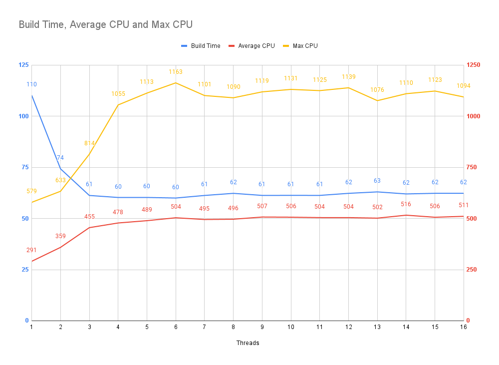

<h1>Writing a Bundler - Part 1</h1>

## Introduction

In today's web development landscape, web applications require a bundler to transpile, combine, and optimize the source code of a project so that end users receive distributable code that is optimally packaged for downloading and executing within their browser.

Bundlers themselves have been around for a while, gaining more features as web applications have become more complex.

Many bundlers have appeared over the years, each learning from their predecessors and brining with them distinct features and advancements - such as; 

- Dead code elimination (commonly known as tree shaking)
- Federated modules
- Hot module reloading
- Faster build times
- Faster run times
- etc

Many web tools are written in JavaScript or TypeScript, like the TypeScript compiler itself. Recently, a popular trend has been to create build tooling using a language better suited to handling the demanding workloads of those tools.

A common choice is Rust - [rspack](https://www.rspack.dev/), [turbopack](https://turbo.build/pack). Another common choice is Go - [esbuild](https://esbuild.github.io/).

Both languages offer fantastic features to enable building high performance and aggressively multi-threaded bundlers.

An interesting case study for writing a multi-threaded bundler in JavaScript is the [Parcel bundler](https://parceljs.org/). 

Parcel brought to the bundling world many novel features; like incremental bundling, a cache system, a plugin system that is both ergonomic and sensible, and an opinionated zero-configuration (or minimal-configuration) build environment.

This allowed for drastically simplified development environments that had a reduced burden of dependency maintenance.

<div class="column border no-padding">
<div>

```json?<%- util.query({ title: "Which Allows This:", border: false }) %>
{
  "devDependencies": {
    "copy-webpack-plugin": "*",
    "css-loader": "*",
    "html-webpack-plugin": "*",
    "mini-css-extract-plugin": "*",
    "sass": "*",
    "sass-loader": "*",
    "style-loader": "*",
    "ts-loader": "*",
    "typescript": "*",
    "webpack": "*",
    "webpack-bundle-analyzer": "*",
    "webpack-cli": "*",
    "webpack-dev-server": "*",
    "worker-loader": "*"
  }
}
```


</div>
<div>

```json?<%- util.query({ title: "To Become This:", border: false }) %>
{
  "devDependencies": {
    "parcel": "*"
  }
}
```

</div>
</div>

Parcel's plugin system allowed for extensibility where required, however by default Parcel ships everything you need to build a modern web application.

In addition - Parcel leverages Node.js worker threads, scheduling jobs across threads, to improve bundling performance.

This series will embark on a journey to create a simple bundler, written in Rust, that is heavily inspired by the philosophy that Parcel embodies.

_Disclaimer:_

Throughout the series, I will analyze and compare Parcel with our creation - this isn't intended as a criticism of Parcel or aimed at insinuating that my spin off is better than Parcel. 

There is simply no way that I, alone, could create something as comprehensive as Parcel. Parcel is a project with many brilliant and dedicated contributors and ultimately a lot of what I will be creating here will be taken directly from Parcel - borrowing learnings from their work that I never would have come to myself.

## Objective

We are going to write our own bundler in Rust, one that targets building applications which exist at "hyper" scale.

I define hyper scale as an application that has tens of thousands of source files - presumably operating with millions of users (aspirational I know).

I picked this target because this is a context where conventional bundler tooling tends to struggle and the biggest gains from threading are to be had.

I would like to preserve the plugin model offered by Parcel as best as possible as I find it to be extremely ergonomic, supporting both dynamically loaded plugins written in Rust and plugins written in JavaScript.

This first article will center around the creation of the first phase in the bundling process - transformation.

## Bundler Phases At A High Level

Parcel's bundling pipeline follows roughly the following flow:

<br>

<wc-embed-svg class="img" loading="lazy" width="60%" src="../2023-12-14-how-fast-can-you-bundle-part-1/assets/diagrams/bundler-high-level.svg" ></wc-embed-svg>
<br>

You can also view a more descriptive flow diagram on [Parcel's website](https://parceljs.org/plugin-system/overview/)

### The Transformation Pipeline

The transformation pipeline is a simple recursive loop (in behavior, not implementation) that traverses over the source files of a project; where imports are extracted and used to trigger the next loop.

The loop exits when there are no more imports to resolve and all the files have been processed.

The transformation pipeline is broken down into 2 major steps

- Resolving imports
- Transforming Files

To start off, an "entry" file is passed into the pipeline, the `import` declarations are extracted resulting in the pipeline discovering new files to transform - continuing the loop.

The new found files have their `import` declarations extracted, again continuing the loop, stopping once all the `import`s in a project have been extracted.

During transformation, the file is read, potentially converted from TypeScript to JavaScript then stored in memory within a "store". 

Parcel actually writes these transform results to disk but for the sake of simplicity, we will keep them in memory unless it becomes a problem.

<video controls autoplay muted loop class="m">
  <source src="assets/video-1.mp4" type="video/mp4">
</video>

### Resolution

The first step in the transformation loop is dependency resolution. To understand resolution we must first understand JavaScript imports.

Simply, JavaScript imports adhere to the following syntax:

```javascript
import something from "specifier";
import "specifier"
```

The string used as the target of an import is known as the "specifier".

The specifier could be a relative path, absolute path, or an alias with rules described by the runtime or the bundler.

```javascript
import { fromRelative } from "./relative"
import { fromAbsolute } from "/probably/dont/do/this"

// Rules specific to Node.js that obtains an import from 
// the node_modules folder. This is known as "node module resolution"
import { fromNodeModules } from "npm:lodash/get"

// Rules specific to Node.js that obtains an import from 
// the internal Node.js standard library
import { exists } from "node:fs"

// Special custom rules the developer can specify in the bundler
// to allow path aliases. These are arbitrary, I am using "~root/*"
// but it could be anything from "asd" to "&%$hello/*" 
import { fromAlias } from "~root/some-path"
```

A bundler written in JavaScript can inherit some of these resolution properties, however a bundler written in Rust must reimplement them.

Thankfully, Parcel has a [Rust crate](https://github.com/parcel-bundler/parcel/tree/v2/packages/utils/node-resolver-core) that implements the Node.js resolution algorithm - which we will use as is.

To resolve an import, the bundler needs two pieces of information:
- A `from` path - describing the absolute path of the file doing the importing 
- A `specifier` - describing the thing being imported

The resulting output of an import resolution is an absolute path to the target file of the import statement. 

#### Example

```javascript
// Imported by: "/absolute/path/to/index.js"
import "./a.js" // Will resolve to: "/absolute/path/to/index.js"
```

### Transforming the file contents and extracting new specifiers

After the specifier has been resolved to an absolute path of the dependency, the absolute path is passed to the transformer.

The transformer will read the file contents from the disk then, using a JavaScript parser like [SWC](https://play.swc.rs/?version=1.3.100&code=H4sIAAAAAAAAA8vMLcgvKlFIy89XSCvKz1VQArKUuJLz84rzc1L1cvLTNYACmlwAcKvMWScAAAA%3D&config=H4sIAAAAAAAAA1WPSw7DIAwF9zkF8rrbdtE79BCIOhERP9mOVBTl7oUE0maH3xszsA5KwcwGnmotxzIkTYx0ziXhHER%2FSgKSE7IhmwRuvRWu1agd4x5tRwOiaUKpW8j3hoOLkbHjLfM22DH%2FC030iZD5ClZUh8nhVTc0Jfj4XvayfaQ%2B9tA%2F4Ad12XkxWH71TaEFh%2B0LYuVI0xQBAAA%3D), will convert the source code into an AST.

<div class="column border no-padding">
<div>

```javascript?<%- util.query({ title: "Source code:", border: false }) %>
import foo from 'foo'
```

</div>
<div>

```json?<%- util.query({ title: "Resulting AST:", border: false }) %>
{
  "type": "Module",
  "body": [
    {
      "type": "ImportDeclaration",
      "specifiers": [
        {
          "type": "ImportDefaultSpecifier",
          "local": {
            "type": "Identifier",
            "value": "foo",
            "optional": false
          }
        }
      ],
      "source": {
        "type": "StringLiteral",
        "value": "foo",
        "raw": "\"foo\""
      }
    }
  ]
}
```

</div>
</div>

We can then walk the AST, identify the imports, extract the specifiers and give them to the next iteration of the loop.

Once again, [Parcel has a Rust crate](https://github.com/parcel-bundler/parcel/tree/v2/packages/transformers/js/core) for its transformation step that we will use in our bundler. We will actually reimplement this later on in the series, but it will be helpful in getting us off the ground.

#### Example

A file with the contents:

```javascript
// Current file path: "/absolute/path/to/index.js"
import "./a.js"
import "./b.js"
import "node:fs"
import "npm:lodash"
```

Will see the transformer return following information to be used in the next iteration of the transformation pipeline loop:

```json
{
    "from_path": "/absolute/path/to/index.js",
    "specifiers": [
        "./a.js",
        "./b.js",
        "node:fs",
        "npm:lodash"
    ]
}
```

## The Benchmark

So let's get started.

The first thing we need is something to bundle. For this I have taken the familiar [three-js benchmark](sources/vendor/three-js) used by esbuild, Parcel and other bundlers. 

[Three JS](https://github.com/mrdoob/three.js/tree/dev/src) is a suitable benchmark because it has a large dependency graph, non trivial transformations, is written using valid module syntax and has no external dependencies.

To scale the benchmark up; we take the three-js source code and copy it 250 times. This results in a project that contain approximately 90,000 source files.


We then need to generate an entry point that imports each copy and re-exports it to avoid the bundler optimizing away unused imports.

```javascript
import * as copy_1 from './copy_1/Three.js';
import * as copy_2 from './copy_2/Three.js';
import * as copy_3 from './copy_3/Three.js';
// ... to 250

// To avoid tree shaking:
window.copy_1 = copy_1;
window.copy_2 = copy_2;
window.copy_3 = copy_3;
// ... to 250
```

## Test Hardware

I will be using my personal desktop computer that has the following hardware:

<wc-embed-html loading="lazy" src="./assets/screenfetch.html"></wc-embed-html>

## Baseline

To obtain a baseline for performance, I compiled the benchmark project using Parcel and recorded the resource usage with [procmon](https://github.com/alshdavid/procmon).

The number of worker threads Parcel spawns is controlled with the `PARCEL_WORKERS` environment variable, by default it has a maximum value of `4`. 

Node.js has a quirk where the process has an explicit heap memory ceiling which applies to the main process as well as to worker threads. By default node grants something like 1gb per thread. For the build to pass I had to increase Node.js's worker memory ceiling with the `node --max-old-space-size=xxxx` command line argument to 6gb per thread.

Unfortunately, the project size was too great and Parcel was unable to compile the entire project, however I was able to complete the transformation pipeline and profile that successfully - the build fails during the later optimization stage.

_Parcel was able to compile a project with 50 copies of three-js, I have yet to determine the point at which it becomes too large_

```bash
env \
    PARCEL_WORKERS=16 \
    PARCEL_EXIT_TRANSFORM=true \
    PM_MEM_UNITS=mb \
    PM_TIME_UNITS=s \
    PM_TRACK=cpu,memory \
    PM_REPORT=parcel.csv \
        procmon \
            node \
                --max-old-space-size=6000 \
                ./node_modules/parcel/lib/bin.js build ./entry/entry.js \
                    --no-cache --dist-dir ./dist --cache-dir .cache
```

### Results

*Note: Keep in mind this is not a full build, this is just the transformation phase of the build*

Running the build we see the following results:


The transformation took 60 seconds where the CPU usage peaked at about 11 cores and averaged 5 cores. The process consumed 7gb of RAM.

Let's inspect the relationship between the number of threads against the transformation time.

To do this I am using the following bash:

```bash
for THREADS in $(seq 0 15); do
    rm -rf dist .cache
    env \
        PARCEL_WORKERS=$THREADS \
        PARCEL_EXIT_TRANSFORM=true \
        PM_MEM_UNITS=mb \
        PM_TIME_UNITS=s \
        PM_TRACK=cpu,memory \
        PM_REPORT=parcel_$THREADS.csv \
            procmon \
                node \
                    --max-old-space-size=5000 \
                    ./node_modules/parcel/lib/bin.js build ./entry/entry.js \
                        --no-cache --dist-dir ./dist --cache-dir .cache
done
```

When the `PARCEL_WORKER` variable is set to `0`, Parcel will run the compilation on the main thread. So that means `main thread + n workers = total threads`.



What we can observe is that we stop seeing improvements beyond 4 threads however there is a continued escalation of maximum CPU usage, while average CPU usage remains the same.

### Why does Parcel behave like this?

Parcel.js is largely written in JavaScript and runs in a Node.js environment. While hot paths within Parcel are written as native Rust modules - the orchestration logic and data structures are held in JavaScript.

In most languages, state can be shared between threads where race conditions can be mitigated through the use of mutexes or other such forms of synchronization.

Node.js, by contrast, completely isolates each thread - making shared mutable access impossible (or impractical). 

Instead, multi-threaded Node.js applications rely on the `postMessage` API to send messages between threads - where actions can be triggered independently of each other thereby eliminating the possibility of race conditions.

Data sent via `postMessage` is cloned using a lightweight deep clone implementation present in the [`structuredClone()`](https://developer.mozilla.org/en-US/docs/Web/API/structuredClone) function.

Node.js does not allow complex types like classes, functions or object containing functions to be sent across threads, however basic data types are permitted:

```typescript
// Non exhaustive but you get the point
type BasicType = string | number | bool
type BasicArray = Array<BasicType | BasicArray | BasicObject>
type BasicObject = Record<string | number, BasicType | BasicArray | BasicObject>
```

#### Example

An example of how communication across threads occurs.

```javascript
// This is analogous to starting a sub process with a separate entry point
const worker = new Worker('./worker.js')

// Listen to messages from the worker
worker.addEventListener('message', (data) => {
    console.log(data)
})

// Send a message to the worker
worker.postMessage('Hello from parent')
```

There is one type that Node.js allows sending across workers which does facilitate shared mutable state - the `SharedArrayBuffer`. 

A `SharedArrayBuffer` is essentially a fixed sized array with `0|1` values within it. 

Mutations to the `SharedArrayBuffer` are available instantly through threads as it's a shared mutable reference - however you need to cast normal data types (like `string`, etc) into the `SharedArrayBuffer` and read them out of the buffer.

This necessitates complex wrappers and, should you need more size than the `SharedArrayBuffer` contains, you must create a new `SharedArrayBuffer` instance and manually stitch together pages.

This makes using a `SharedArrayBuffer` highly impractical for most use cases.

Parcel stores the state of the bundle graph within pages of `SharedArrayBuffer` instances, however that is not used within the transformation pipeline.

During transformation, we are simply concerned with resolving and converting files - during this phase Parcel simply clones and sends many internal data structures between threads using `postMessage`.

The main thread acts as an orchestrator for this communication however in a project that is large enough, the main thread will be unable to cope with managing the messaging for more than a few CPUs at a time - forcing cores to sit idle waiting for work while the orchestrator is overwhelmed with the side quest of copying/serializing stuff.

That said, what the Parcel team have accomplished within the context of Node.js is truly remarkable. Parcel is a case study that demonstrates just how far you can push Node.js in terms of performance and, in the arena of bundlers written in JavaScript, Parcel outperforms every single one!

_Side note: Parcel currently has an experimental implementation of a shared structured memory utility currently in RC phase known as ParcelDB. The Parcel team has the ambition to migrate Parcel to Rust in the future, however this must be an incremental process. ParcelDB aims to facilitate this migration while simultaneously improving the performance of the existing bundler. It's super cool._

Bundlers and other similar build tools must efficiently scale vertically on client machines to make maximal use of the available hardware and deliver an outstanding experience and it appears that, at the time of writing, Node.js presents a poor substrate for high performance multi-threaded applications.

So let's try figure out how to do it in Rust!

## Let's Build A Bundler (Transformer)

### TypeScript

Reviewing the circuit for the transformation pipeline, it's possible to create a simple, single threaded implementation in TypeScript that serves as a familiar environment to describe the flow.

```typescript
import * as fs from 'node:fs'
import { resolve } from '@parcel/node-resolver-core'
import { transform } from '@parcel/transformer-js'

// Parse CLI arguments
let config = new Config();

// A queue that contains the files to resolve
let todo: Array<{ from_path: string, specifier: string }> = []

// A store that maps the absolute file path to the contents of an asset
let assets = new Map<string, string>()

// A set with the absolute file path of a parent concatenated with the
// absolute file path of its dependency
let asset_graph = new Set<string>()

// Add entry asset to queue
todo.unshift({ from_path: process.cwd(), specifier: config.entry_point })

// Loop until the queue is empty
while (todo.length !== 0) {
    // Take an item from the front of the queue
    const { from_path, specifier } = todo.pop()

    // Find the absolute path of the dependency
    let absolute_path = resolve(from_path, specifier)

    // Add that dependency as a child of the parent 
    asset_graph.set(`${from_path}->${absolute_path}`)

    // Continue if the child has already been transformed
    if (assets.has(absolute_path)) {
        continue
    }
    
    // Read the contents of the dependency
    let contents = fs.readFileSync(absolute_path, 'utf8')

    // Transform the contents and extract any import specifiers
    let result = transform(contents, absolute_path)

    // Add the specifiers to the back of the queue
    for (const specifier in result.specifiers) {
        todo.unshift({ from_path: absolute_path, specifier })
    }

    // Add the contents of the new asset to the asset store
    assets.set(absolute_path, result.content_transformed)
}

// .....
// Begin the next phase
```

### Now in Rust

This is a good starting point and is not that different when ported to Rust ([link to source](https://github.com/alshdavid/davidalsh-com/tree/main/posts/2023-12-14-how-fast-can-you-bundle-part-1/sources/single-threaded-transformer)):

```rust
use std::fs;
// ...

fn main() {
    // Queue of files to transform
    let mut queue = VecDeque::<(PathBuf, String)>::new();
    // Map of path -> asset contents
    let mut assets = HashMap::<PathBuf, String>::new();
    // Graph as tuples rather than strings
    let mut asset_graph = HashSet::<(PathBuf, PathBuf)>::new();

    // Add entry asset to queue
    queue.push_back((config.project_root.clone(), config.entry_point.clone().to_str().unwrap().to_string()));

    // Loop until the queue is empty
    while let Some((from_path, specifier)) = queue.pop_front() {
        // Resolve and ignore errors
        let absolute_path = resolve(&from_path, &specifier).unwrap();

        // Add to graph
        asset_graph.insert((from_path, absolute_path.clone()));

        // Skip if transformed previously
        if assets.contains_key(&absolute_path) {
            continue;
        }

        // Read file and ignore errors
        let contents = fs::read_to_string(&absolute_path).unwrap();

        // Transform file
        let (content_transformed, specifiers) = transform(&contents, &absolute_path);

        // Add new specifiers to queue
        for specifier in specifiers.iter() {
            queue.push_back((absolute_path.clone(), specifier.clone()));
        }

        // Add asset to the asset store
        assets.insert(absolute_path, content_transformed);
    }
}

// .....
// Begin the next phase
```

That's pretty sweet... how does the single threaded Rust transformer perform?

```bash
cargo build --release

env \
    PM_MEM_UNITS=mb \
    PM_TIME_UNITS=s \
    PM_TRACK=cpu,memory \
        procmon \
            ./target/release/single-threaded-transformer "../parcel/entry/entry.js"
```
#### Results


Looking at the chart, on a single thread, our home baked transformer circuit was able to transform the 90k source file three-js benchmark in 40 seconds and consumed 600mb of ram while doing it!

As expected, the CPU was locked at 1 core being used at 100% and the memory usage grew linearly as the contents of the files were loaded into memory.

To be fair, Parcel stores a lot more information about assets and the environment the bundler is running in - however this is a pretty impressive result.

### Multithreading

Let's try to make this circuit multi-threaded.

The simplest approach is to spawn a number of OS threads and protect the shared data structures behind mutexes.

In Rust this is done by wrapping them in an `Arc<Mutex<T>>` like this:

```rust
let queue = Arc::new(Mutex::new(VecDeque::<(PathBuf, String)>::new()));
let assets = Arc::new(Mutex::new(HashMap::<PathBuf, String>::new()));
let asset_graph = Arc::new(Mutex::new(HashSet::<(PathBuf, PathBuf)>::new()));
```

An `Arc` is a "smart pointer", which you can think about as a clone-able reference to the value contained within. In effect an `Arc<String>` can be thought of as a `*String`. 

So here we go ([link to source](https://github.com/alshdavid/davidalsh-com/tree/main/posts/2023-12-14-how-fast-can-you-bundle-part-1/sources/multi-threaded-transformer)):

```rust
fn main() {
    // Parse CLI arguments
    let config = Config::new();
    println!("Threads: {}", config.threads);

    // Queue of files to transform
    let queue = Arc::new(Mutex::new(VecDeque::<(PathBuf, String)>::new()));
    // Channel to notify parked threads when new work comes in
    let (notify_queue_push, on_queue_push) = crossbeam_channel::unbounded::<()>();
    // Counter of the tasks in flight
    let in_flight = Arc::new(AtomicUsize::new(0));

    // Map of path -> asset contents
    let assets = Arc::new(Mutex::new(HashMap::<PathBuf, Option<String>>::new()));
    // Graph as tuples rather than strings
    let asset_graph = Arc::new(Mutex::new(HashSet::<(PathBuf, PathBuf)>::new()));

    // Add the entry asset to queue
    in_flight.fetch_add(1, Ordering::Relaxed);
    queue.lock().unwrap().push_back((
        config.project_root.clone(),
        config.entry_point.clone().to_str().unwrap().to_string()
    ));

    // Hold the threads so we know when they all exit
    // In JavaScript terms, you can sort of think of this as an "Array<Promise<void>>"
    let mut thread_handles = Vec::<JoinHandle<()>>::new();

    // Spawn a bunch of threads, this loop will exit immediately and the main thread will block
    // at the end where we have the "handle.join()" code
    for _ in 0..config.threads {
        // Clone all of the Arcs - this clones the pointer, not the value
        // Rust will move the cloned pointers into the thread
        // You can think of this as a sort of "dependency injection" for each thread
        let queue = queue.clone();
        let assets = assets.clone();
        let asset_graph = asset_graph.clone();
        let in_flight = in_flight.clone();
        let notify_queue_push = notify_queue_push.clone();
        let on_queue_push = on_queue_push.clone();

        // In JavaScript terms, you can think of "thread::spawn()" as "setTimeout(cb)" if it returned a Promise
        thread_handles.push(thread::spawn(move || {
            // Keep looping while there are active jobs
            while in_flight.load(Ordering::Relaxed) > 0 {
                let Some((from_path, specifier)) = queue.lock().unwrap().pop_front() else {
                    // If there are no items in the queue wait to get a message saying there are
                    on_queue_push.recv().unwrap();
                    continue;
                };

                // Resolve and ignore errors
                let absolute_path = resolve(&from_path, &specifier).unwrap();

                // Add to graph
                asset_graph.lock().unwrap().insert((from_path, absolute_path.clone()));

                // In the case where multiple different files import the same target file, it's  
                // possible that the same file will be resolved from different threads. To prevent  
                // that file from being transformed multiple times, we hold the lock to the
                // the shared data store, check if the file has already been transformed and
                // if it hasn't, we insert a placeholder preventing others from trying.
                let mut assets_unlocked = assets.lock().unwrap();

                // Skip if transformed previously
                if assets_unlocked.contains_key(&absolute_path) {
                    // This job is done
                    in_flight.fetch_sub(1, Ordering::Relaxed);
                    continue;
                }

                // Insert a placeholder so other threads will skip it when checking if it exists
                assets_unlocked.insert(absolute_path.clone(), None);
                
                // Unlock the mutex manually
                drop(assets_unlocked);

                // Read file and ignore errors
                let contents = fs::read_to_string(&absolute_path).unwrap();

                // Transform file
                let (content_transformed, specifiers) = transform(&contents, &absolute_path);

                for specifier in specifiers.iter() {
                    // Add new specifiers to queue
                    in_flight.fetch_add(1, Ordering::Relaxed);
                    queue.lock().unwrap().push_back((absolute_path.clone(), specifier.clone()));
                    // Tell other parked threads that new work is available 
                    notify_queue_push.send(()).unwrap();
                }

                // Add asset to the asset store
                assets.lock().unwrap().insert(absolute_path, Some(content_transformed));

                // This job is done
                in_flight.fetch_sub(1, Ordering::Relaxed);
            }
        }));
    }

    // Wait for all the threads to finish
    // Kinda like "Promise.all()"
    for handle in thread_handles {
        handle.join().unwrap();
    }

    println!("Assets: {}", assets.lock().unwrap().len());
}
```

### Results

Running this circuit against the 250x three-js project using 16 threads:


🤯🤯🤯🤯🤯🤯🤯🤯🤯🤯 **3 seconds!?**

Doing some napkin math, given the single threaded run took 40 seconds; 40 seconds divided by 16 cores is 2.5 seconds - so a transformation time of 3 seconds does make sense and indicates there is the potential to improve this further at some point.

In reality you never see gains that match dividing the time a single threaded task took by the number of threads, but we did get pretty close!

Another interesting thing to note is that the library I am using to track CPU usage started to lose it with the higher CPU utilization.

Let's have a look at the build time vs thread count looks like:

```bash
cargo build --release
for THREADS in $(seq 1 16); do
    env \
        HS_THREADS=$THREADS \
        PM_MEM_UNITS=mb \
        PM_TIME_UNITS=s \
        PM_TRACK=cpu,memory \
        PM_POLL_INTERVAL=250 \
        PM_REPORT=hypersonic_$THREADS.csv \
            procmon \
                ./target/release/multi-threaded-transformer "./parcel/entry/entry.js"
done
```


The blue line tracks the actual build time.

The green line tracks the "theoretical perfect" build time, calculated as `build time of 1 thread / number of threads`

Red and yellow track average and maximum CPU usage.

We can see that we are able to track very closely to the theoretical perfect time and it's likely not worth optimizing further to achieve a better time.

A benefit of this approach is that a time of 6 seconds is still very acceptable, limiting the thread count to 7 leaves us with 9 threads to continue working on other tasks while the build runs - like checking emails or watching YouTube videos.

## Comparison to Parcel

While this transformer circuit attempts to mimic Parcel's transformation circuit - it does not completely encapsulate the work that Parcel is doing.

For example, Parcel is loading plugins dynamically, it's checking assets to determine which plugins to use on them, detecting configuration and supplying it to plugins.

It also support many more language features, automatically detecting if the file uses TypeScript or JSX. It supports Node's `require()` syntax as well as JavaScript's `import` syntax.

It's also generating a much more complex graph of the asset relationships to use for advanced optimizations like dead code elimination.

While we do see a 20x improvement in the time it takes for this circuit to run - this isn't indicative of the real world expectations of how a bundler like Parcel would perform if migrated to Rust.

That said, it does make me excited to see how the Parcel project performs once migrated to Rust - there certainly seems a lot to be gained in the way of performance.

## Next Article

In the next article we will dive into **bundling**. We will walk through analyzing the asset graph to determine when to combine source files and generate a "bundle graph".

FIN 🌴
